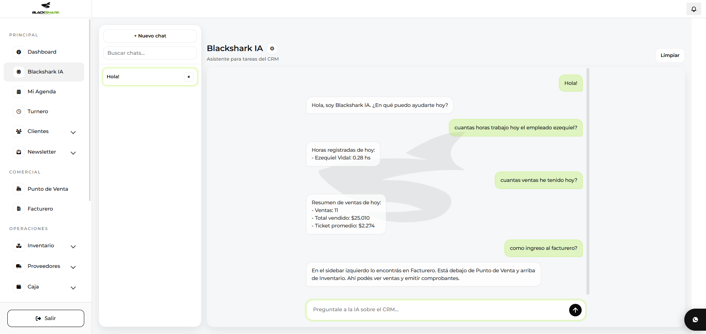

# Blackshark CRM

Multi-tenant CRM platform built to centralize client management, sales and business operations.

## Overview

Blackshark CRM is a SaaS product designed for businesses that need to manage clients, sales and daily operations in one place.

It is focused on solving fragmented workflows by bringing business data, customer management and operational tools into a single platform.

## Features

- Multi-tenant architecture
- PHP backend
- REST API integration
- AI module for data queries and insights
- Business operations and sales management
- Modular structure for scalable growth

## Tech Stack

- PHP
- JavaScript
- MySQL
- REST APIs

## Status

Active product in early stage with real client usage.

## Screenshots

### AI Module

  

### Ticket Module

  

### Sales by Weight

  

## Live Product

👉 https://crm.blackshark.com.ar
